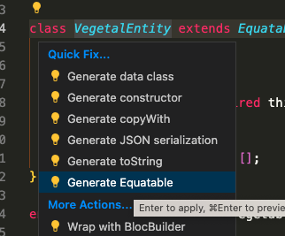

# Flutter Starter

A Flutter starter to quickly create a new flutter app


### Flutter version management 

https://fvm.app/docs/getting_started/installation

```
fvm use 3.10.2 # Check lastest version inside .fvm/fvm_config.json
```

Inside .zshrc / your terminal

export PATH="$PATH:/Users/dleurs/fvm/versions/3.10.2/bin"

```
flutter --version
```
```
Flutter 3.10.2 • channel stable • https://github.com/flutter/flutter.git
Framework • revision 9cd3d0d9ff (2 days ago) • 2023-05-23 20:57:28 -0700
Engine • revision 90fa3ae28f
Tools • Dart 3.0.2 • DevTools 2.23.1
```

# Adding an endpoint

## Example implementing OPEN Api https://fruityvice.com/api/fruit/all

Create folders ```fruits``` under ```lib/features```

Then go inside this folder and execute : 

```
mkdir domain;
cd domain;
mkdir entities;
mkdir repository;
mkdir usecases;
cd ..;

mkdir data;
cd data;
mkdir data_sources;
mkdir models;
mkdir repoditory;
mkdir mapper;
cd ..;

mkdir cd presentation;
cd presentation;
mkdir bloc;
mkdir pages;
mkdir widgets;
cd ..;
```

### I. Domain

You can start with data layer if the structure of your data will be retrived from api. But ideally you should start with domain, the part that is independ from data sources. 

Inside ```lib/features/fruits/domain/entities``` : 

```fruits.dart```
```
// ignore_for_file: public_member_api_docs, sort_constructors_first
import 'package:equatable/equatable.dart';

class VegetalEntity extends Equatable {
  final String name;
  final VegetalType type;

  const VegetalEntity({required this.name, required this.type});

  @override
  List<Object> get props => [name, type];
}

enum VegetalType { fruits, vegetables }
```
Download on VSCode extension : ```Dart Data Class Generator```




### II. Data

#### I.1.

