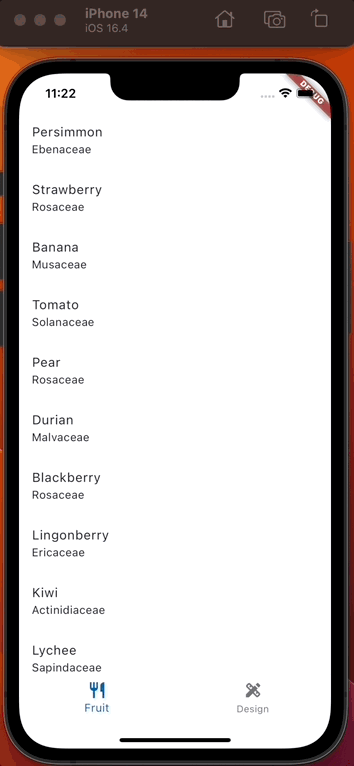
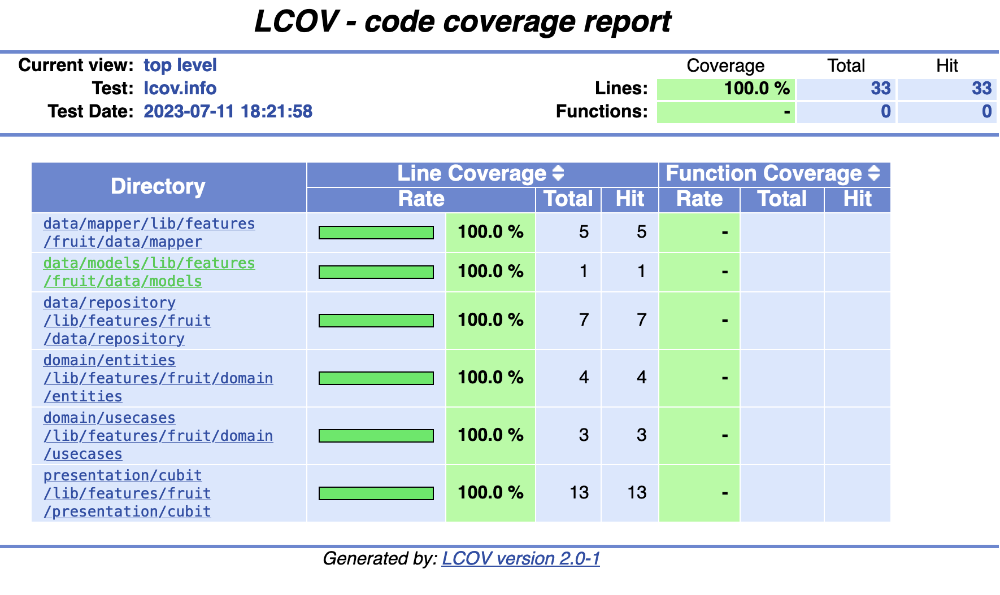

# Flutter Starter

Here in this project with my current knowledge

## Other flutter starters to consider

1. https://cli.vgv.dev & https://github.com/VeryGoodOpenSource/very_good_templates/tree/main/very_good_core
2. Bloc examples https://github.com/felangel/bloc/tree/master/examples
3. https://github.com/zeref278/flutter_boilerplate?tab=readme-ov-file
4. https://github.com/ntminhdn/Flutter-Bloc-CleanArchitecture

## Demo current starter



## What is inside this project ?

1. State management using Cubit
2. Clean archi : Presentation / Domain / Data : 
- UI <-- BlocBuilder --> Cubit <-- function/state --> UseCase <-- Entity --> Repository <-- Model --> API
3. Unit tests with code coverage with lcov
4. Typography, color palettes and components of the app displayed 
5. [Coming soon] Golden test and integration test
6. [Coming soon] Navigation for mobile and web with Beamer
7. [Coming soon] Internalisation with Firebase, dealing with online and offline
8. [Coming soon] Dev / Staging / Prod versions
9. [Coming soon] CICD fastlane locally and with Github Actions, upload to Google Play / Apple Store
10. [Coming soon] OpenAPI and DTO automatically generated with back / Back for Front & access to a swagger (or postman/insomnia if not possible)
11. [Coming soon] Design system with dark mode and custom text / extensions, commun base widgets (AppText, AppGap, AppPadding)


Bonuses : 
- HTTP Rest request with Retrofit & Dio
- [Coming soon] Configuration with Firebase Remote Config 
- [Coming soon] Handling crash and crashlytics with Firebase
- [Coming soon] Handling analytics / screen times with Firebase
- [Coming soon] Handling internalisation with Google Sheet
- [Coming soon] Hosting flutter web 
- [Coming soon] Authentication forms
- [Coming soon] Handling fvm, flutter version management
- [Coming soon] Splash screen to initialize the app (remote config)

## Open discussion on some packages / strategies

Things to consider implementing from beginning : 
- [Dev and prod] Version management control (show or force app update), linked with Firebase remote config or flutter_upgrade_version
  - Feature flags can also be added, that can me modified remotly with Firebase remote config
- [Dev and prod] Pop up / modal when a new version has been installed to explained what new

Other cool stuff : 
- [Dev only] HTTP request observer (https://pub.dev/packages/alice)
- [Dev only] Design pattern observer
- [Dev and prod] In app review and to right moment to ask review (https://pub.dev/packages/in_app_review)
- [Dev and/or prod] Better UI Feedback provider linked to github / gitlab (https://pub.dev/packages/feedback) with automatically mail sended with content of the message in order to respond
- [Dev and prod] Show version of the app (https://pub.dev/packages/package_info_plus)

Other stuff : 
- [Dev and prod] When to have notification consent ? After registration ? Login ? Launching the app ?
- [Dev and prod] Cookie consent at the start or splash
- [Dev and prod] Privacy policy and general conditions of use

## VSCode packages

- Flutter
- Dart
- Bloc
- Better Comments
- Gitlens
- Material Icon Theme
- Error Lens
- Image preview

###  

```
fvm use 3.13.4
```
Check lastest version inside ```.fvm/fvm_config.json```

Inside .zshrc / your terminal
```
export PATH="$PATH:/Users/dleurs/fvm/versions/3.10.2/bin"
```
```
fvm flutter --version

Flutter 3.10.2 • channel stable • https://github.com/flutter/flutter.git
Framework • revision 9cd3d0d9ff (2 days ago) • 2023-05-23 20:57:28 -0700
Engine • revision 90fa3ae28f
Tools • Dart 3.0.2 • DevTools 2.23.1
```

### Package

For tests
```
brew install lcov
dart pub global activate remove_from_coverage
export PATH="$PATH":"$HOME/.pub-cache/bin"
```

## Links

### Documentation

- Check [Flutter docs](https://docs.flutter.dev/ui/widgets-intro), [github's here](https://github.com/flutter/flutter)

- Check [Flutter samples](https://flutter.github.io/samples/#), [github's here](https://github.com/flutter/samples)
### Design

- Check [Material Design 3](https://m3.material.io)

- Check [Material 3 live demo](https://flutter.github.io/samples/web/material_3_demo/#/), [github's here](https://github.com/flutter/samples/blob/main/material_3_demo/lib)

- Check [Figma Material 3](https://www.figma.com/file/WBvXO7j9lPAvScv3AEfh3u/Material-3-Design-Kit-(Community)?type=design&node-id=11-1833&mode=design&t=Nu1Vy66xf64eY9uo-0)

- Check [Flutter Icons](https://api.flutter.dev/flutter/material/Icons-class.html)
# Adding a new HTTP endpoint

Example implementing [fruityvice Free Api](https://fruityvice.com/api/fruit/all)

Create folders ```fruit``` under ```lib/features```

Then go inside this folder and execute : 

```
mkdir domain;
cd domain;
mkdir entities;
mkdir repository_abstract;
mkdir usecases;
mkdir utils;
cd ..;

mkdir data;
cd data;
mkdir data_sources;
mkdir models;
mkdir repository;
mkdir mapper;
cd ..;

mkdir presentation;
cd presentation;
mkdir cubit;
mkdir pages;
mkdir widgets;
cd ..;
```

If your feature require a service, for example getting device platform (iOS or Android) and version, geolocalisation or local database:
```
cd domain;
mkdir dervice;
cd ..;
```

## I. Domain

### I.1 Entity

You can start with data layer if the structure of your data will be taken from the api. But ideally you should start with domain, the part that is independ from the data source. 

Inside ```lib/features/fruits/domain/entities``` : 

```fruits_entity.dart```
```
import 'package:freezed_annotation/freezed_annotation.dart';

part 'fruit_entity.freezed.dart';

@freezed
class FruitEntity with _$FruitEntity {
  const factory FruitEntity({
    required String name,
    required String family,
    required FruitGenus genus,
  }) = _FruitEntity;
}
```

Create generated files : 

```
make generate
```

### I.2 Repository

Inside ```lib/features/fruit/domain/repository_abstract/fruit_repository.dart```

```
import 'package:dartz/dartz.dart';
import 'package:flutter_starter/features/fruit/domain/entities/fruit.dart';

abstract class FruitRepository {
  Future<Either<Exception, List<FruitEntity>>> getFruits();
}
```

Not sure that having Exception type as error a good idea. Maybe creating a one or using DioError

### I.3 Usecase

Most of the times, usecases will just call a repository, but sometimes it can contains more intelligence / more code, and will prevent duplication of code inside of differents cubits calling the same usecase. 

So you can choose not to use usecase to reduce code / or only when needed (intelligence used in multiple cubits).

Inside ```lib/features/fruit/domain/usecases/get_fruit_usecase.dart```

```
import 'package:dartz/dartz.dart';
import 'package:flutter_starter/core/usecase/usecase.dart';
import 'package:flutter_starter/features/fruit/domain/entities/fruit.dart';
import 'package:flutter_starter/features/fruit/domain/repository_abstract/fruit_repository.dart';
import 'package:injectable/injectable.dart';

@injectable
class GetFruitUseCase
    extends BaseFutureWithEmptyParamsUseCase<Exception, List<FruitEntity>> {
  final FruitRepository _fruitRepository;
  GetFruitUseCase(this._fruitRepository);

  @override
  Future<Either<Exception, List<FruitEntity>>> call() async {
    return await _fruitRepository.getFruits();
  }
}
```

Here the usecase and the repo does not have parameters, if so, use ```BaseFutureUseCase<E, T, P>```

## II. Data
### II.1. Models

First, [check the data source on a browser](https://fruityvice.com/api/fruit/all)


```
```

Then, inside ```lib/features/fruit/data/models/fruit_model.dart```

```
import 'package:freezed_annotation/freezed_annotation.dart';

part 'fruit_model.freezed.dart';

@freezed
class FruitModel with _$FruitModel {
  const factory FruitModel({
    String? name,
    String? family,
    String? genus,
  }) = _FruitModel;

  factory FruitModel.fromJson(Map<String, dynamic> json) => _$FruitModelFromJson(json);
}
```

Inside models, everything could be null. You should never trust what will be retrive by the server.

```
make generate
```

### II.2. Data source / API

Inside ```lib/features/fruit/data/data_sources/fruit_api.dart```

```
import 'package:dio/dio.dart';
import 'package:flutter_starter/core/constants/api_constants.dart';
import 'package:flutter_starter/features/fruit/data/models/fruit_model.dart';
import 'package:injectable/injectable.dart';
import 'package:retrofit/retrofit.dart';

part 'fruit_api.g.dart';

@lazySingleton
@RestApi(
  baseUrl: ApiConstants.fruitsClient,
)
abstract class FruitApi {
  factory FruitApi(@Named(ApiConstants.publicHttpClient) Dio dio) = _FruitApi;

  @factoryMethod
  static FruitApi create(@Named(ApiConstants.publicHttpClient) Dio dio) {
    return FruitApi(dio);
  }

  @GET("${ApiConstants.apiFruitPath}/all")
  Future<List<FruitModel>> getFruits();
}
```
Here there is no ```@Path```, ```@Header``` or  ```@Query``` in the request, but they will be in production app. Check retrofit doc.

Retrofit is based on generated code, so you have to execute 
```
make generate
```
Which execute ```dart run build_runner build --delete-conflicting-outputs```

This requires ```lib/core/injection/module/network_module.dart``` to be setup, where HeaderInterceptor can be defined to automatically add authentication token for example


### II.3. Mapper

Inside ```lib/features/fruit/data/mapper/fruit_mapper.dart```

```
import 'package:flutter_starter/core/constants/app_constants.dart';
import 'package:flutter_starter/features/fruit/data/models/fruit_model.dart';
import 'package:flutter_starter/features/fruit/domain/entities/fruit.dart';

extension FruitMapper on FruitModel {
  FruitEntity toEntity() => FruitEntity(
      name: name ?? AppConstants.emptyString,
      family: family ?? AppConstants.emptyString,
      genus: FruitGenus.getFruitGenus(genus));
}

extension FruitListMapper on List<FruitModel>? {
  List<FruitEntity> toEntity() =>
      this?.map((model) => model.toEntity()).toList() ?? List.empty();
}
```

### II.4. Repository Implementation

```
import 'package:dartz/dartz.dart';
import 'package:flutter_starter/features/fruit/data/data_sources/fruit_api.dart';
import 'package:flutter_starter/features/fruit/data/mapper/fruit_mapper.dart';
import 'package:flutter_starter/features/fruit/domain/entities/fruit.dart';
import 'package:flutter_starter/features/fruit/domain/repository_abstract/fruit_repository.dart';
import 'package:injectable/injectable.dart';

@Injectable(as: FruitRepository)
class FruitRepositoryImpl implements FruitRepository {
  final FruitApi _fruitApi;
  FruitRepositoryImpl(this._fruitApi);

  @override
  Future<Either<Exception, List<FruitEntity>>> getFruits() async {
    try {
      final fruitsModel = await _fruitApi.getFruits();
      final fruits = fruitsModel.toEntity();
      return Right(fruits);
    } on Exception catch (ex) {
      return Left(ex);
    }
  }
}
```
## III. Presentation

### III.1. Cubit

Inside ```lib/features/fruit/presentation/cubit/fruit_cubit.dart```

```
import 'package:flutter_bloc/flutter_bloc.dart';
import 'package:flutter_starter/features/fruit/domain/usecases/get_fruit_usecase.dart';
import 'package:flutter_starter/features/fruit/presentation/cubit/fruit_state.dart';
import 'package:injectable/injectable.dart';
import 'dart:developer' as developer;

@injectable
class FruitCubit extends Cubit<FruitState> {
  final GetFruitUseCase getFruitUseCase;

  FruitCubit({
    required this.getFruitUseCase,
  }) : super(FruitState());

  Future<void> getFruits() async {
    emit(state.copyWith(
      isLoading: true,
      fruits: [],
      errorMessage: null,
    ));
    final eitherFruits = await getFruitUseCase();
    return eitherFruits.fold(
      (error) {
        developer.log('Un error occured : ${error.toString()}');
        emit(state.copyWith(
          isLoading: false,
          errorMessage: error.toString(),
        ));
      },
      (value) {
        emit(state.copyWith(
          isLoading: false,
          fruits: value,
        ));
      },
    );
  }
}
```

It is not clean to access state with ```GetIt.instance.get<FruitCubit>().state```. Indeed, in some cases like adding authentication token inside http interceptor, you have to get the info without context. You should then create a Stream / StreamSubcription, and consider HydratedCubit for offline support.

- https://stackoverflow.com/questions/73707762/flutter-access-bloc-without-context
- https://codeclusive.io/blog/flutter-authorization-with-bloc/
- https://stackoverflow.com/questions/73707762/flutter-access-bloc-without-context

Inside ```lib/features/fruit/presentation/cubit/fruit_state.dart```

```
import 'package:flutter_starter/features/fruit/domain/entities/fruit_entity.dart';
import 'package:freezed_annotation/freezed_annotation.dart';

part 'fruit_state.freezed.dart';

@freezed
class FruitState with _$FruitState {
  const factory FruitState({
    @Default(false) bool isLoading,
    @Default([]) List<FruitEntity> fruits,
    String? errorMessage,
  }) = _FruitState;
}
```

Be careful of default value in constructor,```this.isLoading = false,``` 

```
make generate
```


### III.2. Page

Inside ```lib/features/fruit/presentation/pages/fruit_page.dart```

UI should be very stupid, there is no intelligence inside it, just if (that state) then show this widget.

If you should add a little more intelligence, like modify a date presentation from "2023-06-01" to "Jeudi 1 juin 2023", then you should create a static function inside ```lib/features/fruit/domain/utils/fruit_utils.dart``` (Maybe inside presentation folder ?)

**EDIT [2024/03/11] I recommand using BlocSelector and not BlocBuilder**

```
import 'package:dart_extensions/dart_extensions.dart';
import 'package:flutter/material.dart';
import 'package:flutter_bloc/flutter_bloc.dart';
import 'package:flutter_starter/features/fruit/domain/entities/fruit.dart';
import 'package:flutter_starter/features/fruit/presentation/cubit/fruit_cubit.dart';
import 'package:flutter_starter/features/fruit/presentation/cubit/fruit_state.dart';
import 'package:get_it/get_it.dart';

class FruitPage extends StatelessWidget {
  const FruitPage({super.key});

  @override
  Widget build(BuildContext context) {
    return Scaffold(
      body: SafeArea(
        child: BlocProvider<FruitCubit>(
          create: (context) => GetIt.instance.get<FruitCubit>()..getFruits(),
          child: BlocBuilder<FruitCubit, FruitState>(
            builder: (context, state) {
              if (state.isLoading) {
                return const CircularProgressIndicator();
              } else if (state.errorMessage.isEmptyOrNull == false) {
                return Text("Un error occured : ${state.errorMessage}");
              }
              return ListView.builder(
                  itemCount: state.fruits.length,
                  itemBuilder: (context, index) {
                    final fruit = state.fruits[index];
                    return ListTile(
                      title: Text(fruit.name),
                      subtitle: Text(fruit.family),
                      trailing: fruit.genus == FruitGenus.citrus
                          ? const Icon(Icons.restaurant_menu)
                          : null,
                    );
                  });
            },
          ),
        ),
      ),
    );
  }
}
```

### IV. Tests

```
cd test; cd features;
```
```
mkdir fruit; cd fruit;
```

```
mkdir mock;

mkdir domain;
cd domain;
mkdir usecases;
mkdir utils;
cd ..;

mkdir data;
cd data;
mkdir repository;
mkdir mapper;
cd ..;

mkdir presentation;
cd presentation;
mkdir cubit;
mkdir pages;
mkdir widgets;
cd ..;
```

### IV.1. Unit tests

Let's start by test the data layer

#### IV.1.a All tests and mock

```
Inside test/all_tests.dart;
```
```
// Fruit feature
import './features/fruit/data/mapper/fruit_mapper_test.dart' as fruit_mapper_test;
import './features/fruit/data/repository/fruit_repository_test.dart' as fruit_repository_test;
import './features/fruit/domain/usecases/fruit_usecase_test.dart' as fruit_usecase_test;
import './features/fruit/presentation/cubit/fruit_cubit_test.dart' as fruit_cubit_test;

void main() {
  // Fruit feature
  fruit_mapper_test.main();
  fruit_repository_test.main();
  fruit_usecase_test.main();
  fruit_cubit_test.main();
}
```

```
cd mock; touch fruit_data_mock.dart
```
```
class FruitMock {
  
}
```
Then [check brut data](https://fruityvice.com/api/fruit/all) and pick relevant data to mock

You will define : 
- FruitsJson
- FruitsModel
- FruitsEntity

```
import 'package:flutter_starter/features/fruit/data/models/fruit_model.dart';
import 'package:flutter_starter/features/fruit/domain/entities/fruit_entity.dart';

class FruitDataMock {
  static const fruitsJson = {
    [
      {
        "name": "Persimmon",
        "id": 52,
        "family": "Ebenaceae",
        "order": "Rosales",
        "genus": "Diospyros",
        "nutritions": {"calories": 81, "fat": 0.0, "sugar": 18.0, "carbohydrates": 18.0, "protein": 0.0}
      },
      {
        "name": "Lemon",
        "id": 26,
        "family": "Rutaceae",
        "order": "Sapindales",
        "genus": "Citrus",
        "nutritions": {"calories": 29, "fat": 0.3, "sugar": 2.5, "carbohydrates": 9.0, "protein": 1.1}
      },
    ]
  };

  static const fruitsModel = [
    FruitModel(
      name: "Persimmon",
      family: "Ebenaceae",
      genus: "Diospyros",
    ),
    FruitModel(
      name: "Lemon",
      family: "Rutaceae",
      genus: "Citrus",
    ),
  ];

  static const fruitsEntity = [
    FruitEntity(
      name: "Persimmon",
      family: "Ebenaceae",
      genus: FruitGenus.unknown,
    ),
    FruitEntity(
      name: "Lemon",
      family: "Rutaceae",
      genus: FruitGenus.citrus,
    ),
  ];
}
```
#### IV.1.b Mapper

```
cd data; cd mapper; touch fruit_mapper_test.dart;
```
```
import 'package:flutter_starter/features/fruit/data/mapper/fruit_mapper.dart';
import 'package:flutter_starter/features/fruit/data/models/fruit_model.dart';
import 'package:flutter_test/flutter_test.dart';

import '../../mock/fruit_mock.dart';

void main() {
  group('[Fruit] [Mapper] :', () {
    test('FruitModel from Json', () {
      final modelFromJson = FruitModel.fromJson(FruitMock.fruitsJson[0]);
      expect(modelFromJson, equals(FruitMock.fruitsModel[0]));
    });
    test('FruitEntity from FruitModel', () {
      final entityFromModel = FruitMock.fruitsModel[0].toEntity();
      expect(entityFromModel, equals(FruitMock.fruitsEntity[0]));
    });

    test('FruitsEntity (list) from FruitsModel (list)', () {
      final entitiesFromModels = FruitMock.fruitsModel.toEntity();
      expect(entitiesFromModels, equals(FruitMock.fruitsEntity));
    });
  });
}
```

#### IV.1.c Repository

```
cd mock; touch fruit_class_mock.dart
```
```
import 'package:flutter_starter/features/fruit/data/data_sources/fruit_api.dart';
import 'package:mocktail/mocktail.dart';

class MockFruitApi extends Mock implements FruitApi {}
```

```
cd data; cd repository; touch fruit_repository_test.dart;
```
```
import 'dart:async';

import 'package:flutter_starter/features/fruit/data/data_sources/fruit_api.dart';
import 'package:flutter_starter/features/fruit/data/repository/fruit_repository_impl.dart';
import 'package:flutter_test/flutter_test.dart';
import 'package:mocktail/mocktail.dart';

import '../../mock/fruit_class_mock.dart';
import '../../mock/fruit_data_mock.dart';

void main() {
  late FruitApi mockFruitApi;
  late FruitRepositoryImpl repository;

  setUp(() {
    mockFruitApi = MockFruitApi();
    repository = FruitRepositoryImpl(mockFruitApi);
  });

  group('[Fruit] [Repository] :', () {
    test('Calling repository.getFruits() when success', () async {
      //GIVEN
      when(() => mockFruitApi.getFruits()).thenAnswer(
        (_) => Future.value(FruitDataMock.fruitsModel),
      );
      //WHEN
      final result = await repository.getFruits();
      //THEN
      verify(
        () => mockFruitApi.getFruits(),
      ).called(1);

      result.fold(
        (error) => null,
        (data) {
          expect(data, FruitDataMock.fruitsEntity);
        },
      );
    });

    test('Calling repository.getFruits() when error', () async {
      final timeoutException = TimeoutException('timeout');
      //GIVEN
      when(() => mockFruitApi.getFruits()).thenThrow(timeoutException);
      //WHEN
      final result = await repository.getFruits();
      //THEN
      verify(
        () => mockFruitApi.getFruits(),
      ).called(1);

      result.fold(
        (error) {
          expect(error, timeoutException);
        },
        (data) => null,
      );
    });
  });
}
```

#### IV.1.d Usecase

```
cd mock; code fruit_class_mock.dart
```
Add : 
```
class MockFruitRepository extends Mock implements FruitRepository {}
```
```
cd domain; cd usecase; touch fruit_usecase_test.dart;
```
```
import 'dart:async';

import 'package:dartz/dartz.dart';
import 'package:flutter_starter/features/fruit/domain/entities/fruit_entity.dart';
import 'package:flutter_starter/features/fruit/domain/repository_abstract/fruit_repository.dart';
import 'package:flutter_starter/features/fruit/domain/usecases/get_fruit_usecase.dart';
import 'package:flutter_test/flutter_test.dart';
import 'package:mocktail/mocktail.dart';

import '../../mock/fruit_class_mock.dart';
import '../../mock/fruit_data_mock.dart';

void main() {
  late GetFruitUseCase getFruitUseCase;
  late FruitRepository mockFruitRepository;

  setUp(() {
    mockFruitRepository = MockFruitRepository();
    getFruitUseCase = GetFruitUseCase(mockFruitRepository);
  });

  group('[Fruit] [Usecase] :', () {
    test('Calling getFruitUseCase() when success', () async {
      //GIVEN
      when(() => mockFruitRepository.getFruits())
          .thenAnswer((_) async => Future<Either<Exception, List<FruitEntity>>>.value(
                const Right(FruitDataMock.fruitsEntity),
              ));
      //WHEN
      final result = await getFruitUseCase();
      //THEN
      verify(
        () => mockFruitRepository.getFruits(),
      ).called(1);

      result.fold(
        (error) => null,
        (data) {
          expect(data, FruitDataMock.fruitsEntity);
        },
      );
    });

    test('Calling getFruitUseCase() when error', () async {
      final timeoutException = TimeoutException('timeout');
      //GIVEN
      when(() => mockFruitRepository.getFruits())
          .thenAnswer((_) async => Future<Either<Exception, List<FruitEntity>>>.value(
                Left(timeoutException),
              ));
      //WHEN
      final result = await getFruitUseCase();
      //THEN
      verify(
        () => mockFruitRepository.getFruits(),
      ).called(1);

      result.fold(
        (error) => {expect(error, timeoutException)},
        (data) => null,
      );
    });
  });
}
```

#### IV.1.e Cubit

```
cd mock; code fruit_class_mock.dart
```
Add : 
```
class MockFruitRepository extends Mock implements FruitRepository {}
```
```
cd domain; cd usecase; touch fruit_usecase_test.dart;
```
```
import 'dart:async';

import 'package:bloc_test/bloc_test.dart';
import 'package:dartz/dartz.dart';
import 'package:flutter_starter/features/fruit/domain/entities/fruit_entity.dart';
import 'package:flutter_starter/features/fruit/domain/usecases/get_fruit_usecase.dart';
import 'package:flutter_starter/features/fruit/presentation/cubit/fruit_cubit.dart';
import 'package:flutter_starter/features/fruit/presentation/cubit/fruit_state.dart';
import 'package:flutter_test/flutter_test.dart';
import 'package:mocktail/mocktail.dart';

import '../../mock/fruit_class_mock.dart';
import '../../mock/fruit_data_mock.dart';

void main() {
  late GetFruitUseCase mockGetFruitUseCase;

  setUp(() {
    mockGetFruitUseCase = MockGetFruitUseCase();
  });

  FruitCubit buildCubit() {
    return FruitCubit(getFruitUseCase: mockGetFruitUseCase);
  }

  group('[Fruit] [Cubit] :', () {
    final timeoutException = TimeoutException('timeout');

    group('constructor', () {
      test('works properly', () {
        //THEN
        expect(buildCubit, returnsNormally);
      });
    });

    blocTest<FruitCubit, FruitState>(
      'cubit.getFruits() when success',
      setUp: () {
        when(() => mockGetFruitUseCase()).thenAnswer(
            (_) async => Future<Either<Exception, List<FruitEntity>>>.value(const Right(FruitDataMock.fruitsEntity)));
      },

      //WHEN
      build: buildCubit,
      act: (cubit) => cubit.getFruits(),
      //THEN
      expect: () => [
        const FruitState(
          isLoading: true,
          fruits: [],
          errorMessage: null,
        ),
        const FruitState(
          isLoading: false,
          fruits: FruitDataMock.fruitsEntity,
          errorMessage: null,
        )
      ],
    );

    blocTest<FruitCubit, FruitState>(
      'cubit.getFruits() when failure',

      setUp: () {
        when(() => mockGetFruitUseCase())
            .thenAnswer((_) async => Future<Either<Exception, List<FruitEntity>>>.value(Left(timeoutException)));
      },

      //WHEN
      build: buildCubit,
      act: (cubit) => cubit.getFruits(),
      //THEN
      expect: () => [
        const FruitState(
          isLoading: true,
          fruits: [],
          errorMessage: null,
        ),
        FruitState(
          isLoading: false,
          fruits: [],
          errorMessage: timeoutException.toString(),
        )
      ],
    );
  });
}
```

#### IV.1.f Setup coverage

```
brew install lcov
dart pub global activate remove_from_coverage
export PATH="$PATH":"$HOME/.pub-cache/bin"
```

```
make tests
```




