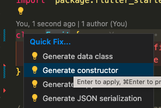
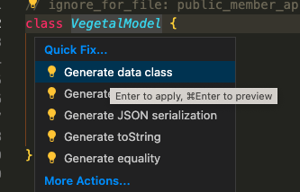
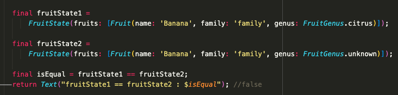
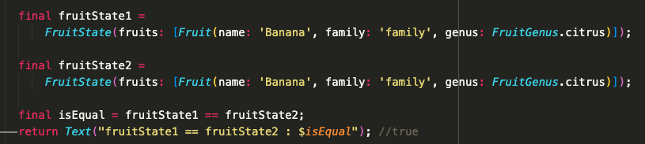
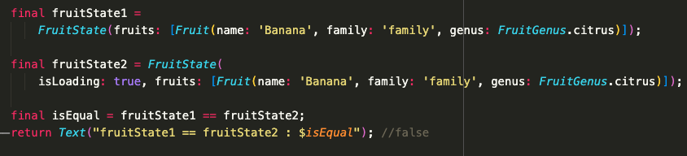
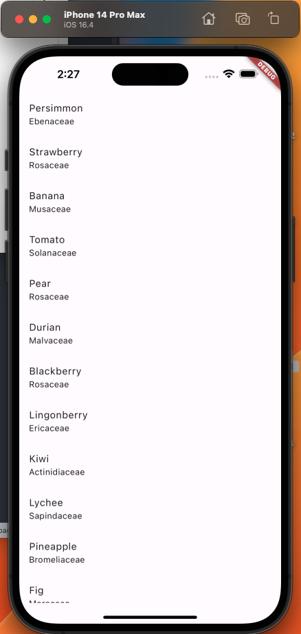

# Flutter Starter

A Flutter starter to quickly create a new flutter app

What is inside this project ?

1. State management using Cubit
2. Clean archi : Presentation / Domain / Data : 
- UI <-- BlocBuilder --> Cubit <-- function/state --> UseCase <-- Entity --> Repository <-- Model --> API
5. [Coming soon] Theming, Design Pattern, black/white theme
6. [Coming soon] Navigation for mobile and web with Beamer
7. [Coming soon] Unit tests with code coverage, golden test ans integration test
8. [Coming soon] Internalisation with Firebase, dealing with online and offline
9. [Coming soon] Dev / Staging / Prod versions
10. [Coming soon] CICD fastlane locally and with Github Actions, upload to Google Play / Apple Store


Bonuses : 
- HTTP Rest request with Retrofit & Dio
- [Coming soon] Stream handling / Firebase Firestore Database
- [Coming soon] Retriving/upload media with Firebase Storage
- [Coming soon] Hosting flutter web with
- [Coming soon] Configuration with Firebase Remote Config 
- [Coming soon] Handling crash and crashlytics
- [Coming soon] Handling analytics / screen times
- [Coming soon] Authentication forms
- [Coming soon] Handling fvm, flutter version management
- [Coming soon] Splash screen to initialize the app


### VSCode config

Check VSCode config ```.vscode/settings.json```

```
"dart.lineLength": 120,
```
### Flutter version management 

https://fvm.app/docs/getting_started/installation

```
fvm use 3.10.2 
```
Check lastest version inside .fvm/fvm_config.json

Inside .zshrc / your terminal
```
export PATH="$PATH:/Users/dleurs/fvm/versions/3.10.2/bin"
```
```
$ flutter --version

Flutter 3.10.2 • channel stable • https://github.com/flutter/flutter.git
Framework • revision 9cd3d0d9ff (2 days ago) • 2023-05-23 20:57:28 -0700
Engine • revision 90fa3ae28f
Tools • Dart 3.0.2 • DevTools 2.23.1
```

# Adding a new HTTP endpoint

Example implementing fruityvice Free Api https://fruityvice.com/api/fruit/all

Create folders ```fruit``` under ```lib/features```

Then go inside this folder and execute : 

```
mkdir domain;
cd domain;
mkdir entities;
mkdir repository;
mkdir usecases;
cd ..;

mkdir data;
cd data;
mkdir data_sources;
mkdir models;
mkdir repoditory;
mkdir mapper;
cd ..;

mkdir cd presentation;
cd presentation;
mkdir cubit;
mkdir pages;
mkdir widgets;
cd ..;
```

## I. Domain

### I.1 Entity

You can start with data layer if the structure of your data will be taken from the api. But ideally you should start with domain, the part that is independ from the data source. 

Inside ```lib/features/fruits/domain/entities``` : 

```fruits.dart```
```
class Fruit {
  final String name;
  final String family;
}
```

Generate constructor with VSCode : 



With VSCode extension ```Dart Data Class Generator```, generate data class.



You can also used @freezed and generated code, but with bug apps it can take up to 5/10 minutes to build everything so I prefer having generated code only if necessary (I am not 100% sure about this, maybe just use generated code without gitignoring it)

Here some tests : 








### I.2 Repository

Inside ```lib/features/fruit/domain/repository/fruit_repository.dart```

```
import 'package:dartz/dartz.dart';
import 'package:flutter_starter/features/fruit/domain/entities/fruit.dart';

abstract class FruitRepository {
  Future<Either<Exception, List<Fruit>>> getFruits();
}
```

Not sure that having Exception type as error a good idea. Maybe creating a one or using DioError

### I.3 Usecase

Inside ```lib/features/fruit/domain/usecases/get_fruit_usecase.dart```

```
import 'package:dartz/dartz.dart';
import 'package:flutter_starter/core/usecase/usecase.dart';
import 'package:flutter_starter/features/fruit/domain/entities/fruit.dart';
import 'package:flutter_starter/features/fruit/domain/repository/fruit_repository.dart';
import 'package:injectable/injectable.dart';

@injectable
class GetFruitUseCase
    extends BaseFutureWithEmptyParamsUseCase<Exception, List<Fruit>> {
  final FruitRepository _fruitRepository;
  GetFruitUseCase(this._fruitRepository);

  @override
  Future<Either<Exception, List<Fruit>>> call() async {
    return await _fruitRepository.getFruits();
  }
}
```

Here the usecase and the repo does not have parameters, if so, use ```BaseFutureUseCase<E, T, P>```

Most of the times, usecases will just call a repository, but sometimes it can contains more intelligence / more code, and will prevent duplication of code inside of differents cubits calling the same usecase

## II. Data
### II.1. Models

First, check the data source on a browser ```https://fruityvice.com/api/fruit/all```


Then, inside ```lib/features/fruit/data/models/fruit_model.dart```

```
class FruitModel {
  final String? name;
  final String? family;
  final String? genus;
}
```

Inside models, everything could be null. You should never trust what will be retrive by the server.

Then, clic ```Generate constructor``` ```Generate data class```

### II.2. Data source / API

Inside ```lib/features/fruit/data/data_sources/fruit_api.dart```

```
import 'package:dio/dio.dart';
import 'package:flutter_starter/core/constants/api_constants.dart';
import 'package:flutter_starter/features/fruit/data/models/fruit_model.dart';
import 'package:injectable/injectable.dart';
import 'package:retrofit/retrofit.dart';

part 'fruit_api.g.dart';

@lazySingleton
@RestApi(
  baseUrl: ApiConstants.fruitsClient,
  parser: Parser.MapSerializable,
)
abstract class FruitApi {
  factory FruitApi(@Named(ApiConstants.publicHttpClient) Dio dio) = _FruitApi;

  @factoryMethod
  static FruitApi create(@Named(ApiConstants.publicHttpClient) Dio dio) {
    return FruitApi(dio);
  }

  @GET("${ApiConstants.apiFruitPath}/all")
  Future<List<FruitModel>> getFruits();
}
```
Here there is no ```@Path```, ```@Header``` or  ```@Query``` in the request, but they will be in production app. Check retrofit doc.

Retrofit is based on generated code, so you have to execute 
```
make generate
```
Which execute ```dart run build_runner build --delete-conflicting-outputs```

This requires ```lib/core/injection/module/network_module.dart``` to be setup, where HeaderInterceptor can be defined to automatically add authentication token for example


### II.3. Mapper

Inside ```lib/features/fruit/data/mapper/fruit_mapper.dart```

```
import 'package:flutter_starter/core/constants/app_constants.dart';
import 'package:flutter_starter/features/fruit/data/models/fruit_model.dart';
import 'package:flutter_starter/features/fruit/domain/entities/fruit.dart';

extension FruitMapper on FruitModel {
  Fruit toEntity() => Fruit(
      name: name ?? AppConstants.emptyString,
      family: family ?? AppConstants.emptyString,
      genus: FruitGenus.getFruitGenus(genus));
}

extension FruitListMapper on List<FruitModel>? {
  List<Fruit> toEntity() =>
      this?.map((model) => model.toEntity()).toList() ?? List.empty();
}
```

### II.4. Repository Implementation

```
import 'package:dartz/dartz.dart';
import 'package:flutter_starter/features/fruit/data/data_sources/fruit_api.dart';
import 'package:flutter_starter/features/fruit/data/mapper/fruit_mapper.dart';
import 'package:flutter_starter/features/fruit/domain/entities/fruit.dart';
import 'package:flutter_starter/features/fruit/domain/repository/fruit_repository.dart';
import 'package:injectable/injectable.dart';

@Injectable(as: FruitRepository)
class FruitRepositoryImpl implements FruitRepository {
  final FruitApi _fruitApi;
  FruitRepositoryImpl(this._fruitApi);

  @override
  Future<Either<Exception, List<Fruit>>> getFruits() async {
    try {
      final fruitsModel = await _fruitApi.getFruits();
      final fruits = fruitsModel.toEntity();
      return Right(fruits);
    } on Exception catch (ex) {
      return Left(ex);
    }
  }
}
```
## III. Presentation

### III.1. Cubit

Inside ```lib/features/fruit/presentation/cubit/fruit_cubit.dart```

```
import 'package:flutter_bloc/flutter_bloc.dart';
import 'package:flutter_starter/features/fruit/domain/usecases/get_fruit_usecase.dart';
import 'package:flutter_starter/features/fruit/presentation/cubit/fruit_state.dart';
import 'package:injectable/injectable.dart';
import 'dart:developer' as developer;

@injectable
class FruitCubit extends Cubit<FruitState> {
  final GetFruitUseCase getFruitUseCase;

  FruitCubit({
    required this.getFruitUseCase,
  }) : super(FruitState());

  Future<void> getFruits() async {
    emit(state.copyWith(
      isLoading: true,
      fruits: [],
      errorMessage: null,
    ));
    final eitherFruits = await getFruitUseCase();
    return eitherFruits.fold(
      (error) {
        developer.log('Un error occured : ${error.toString()}');
        emit(state.copyWith(
          isLoading: false,
          errorMessage: error.toString(),
        ));
      },
      (value) {
        emit(state.copyWith(
          isLoading: false,
          fruits: value,
        ));
      },
    );
  }
}
```

Inside ```lib/features/fruit/presentation/cubit/fruit_state.dart```

```
  final bool isLoading;
  final List<Fruit> fruits;
  final String? errorMessage;
  FruitState({
    this.isLoading = false,
    this.fruits = const [],
    this.errorMessage,
  });
```

Be careful of default value in constructor,```this.isLoading = false,``` 

Then clic ```Generate data class```


### III.2. Page

Inside ```lib/features/fruit/presentation/pages/fruit_page.dart```

UI should be very stupid, there is no intelligence inside it, just if (that state) then show this widget.

If you should add a little more intelligence, like modify a date presentation from "2023-06-01" to "Jeudi 1 juin 2023", then you should create a static function inside ```lib/features/fruit/presentation/utils/fruit_utils.dart```

```
import 'package:dart_extensions/dart_extensions.dart';
import 'package:flutter/material.dart';
import 'package:flutter_bloc/flutter_bloc.dart';
import 'package:flutter_starter/features/fruit/domain/entities/fruit.dart';
import 'package:flutter_starter/features/fruit/presentation/cubit/fruit_cubit.dart';
import 'package:flutter_starter/features/fruit/presentation/cubit/fruit_state.dart';
import 'package:get_it/get_it.dart';

class FruitPage extends StatelessWidget {
  const FruitPage({super.key});

  @override
  Widget build(BuildContext context) {
    return Scaffold(
      body: SafeArea(
        child: BlocProvider<FruitCubit>(
          create: (context) => GetIt.instance.get<FruitCubit>()..getFruits(),
          child: BlocBuilder<FruitCubit, FruitState>(
            builder: (context, state) {
              if (state.isLoading) {
                return const CircularProgressIndicator();
              } else if (state.errorMessage.isEmptyOrNull == false) {
                return Text("Un error occured : ${state.errorMessage}");
              }
              return ListView.builder(
                  itemCount: state.fruits.length,
                  itemBuilder: (context, index) {
                    final fruit = state.fruits[index];
                    return ListTile(
                      title: Text(fruit.name),
                      subtitle: Text(fruit.family),
                      trailing: fruit.genus == FruitGenus.citrus
                          ? const Icon(Icons.restaurant_menu)
                          : null,
                    );
                  });
            },
          ),
        ),
      ),
    );
  }
}
```



